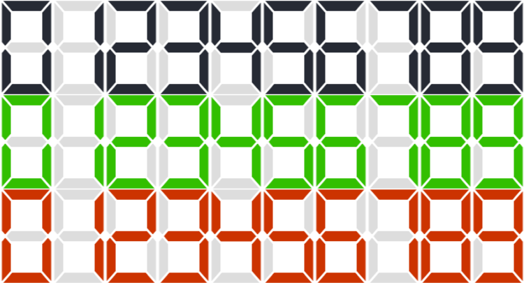
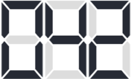
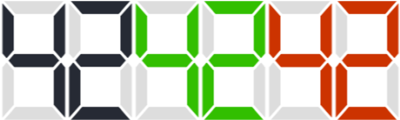

# Studio Led


[](https://github.com/inkasadev/studioled)

A library to show numbers on an LED display.



## Installation

```sh
$ npm install studioled --save
```

## How to use

### ES6

```js
// to import a specific method
import {StudioLed} from "studioled";

const led = new StudioLed({
	element: document.querySelector(".led"),
});

// using  method
led.setValue(42);
```

### CommonJS

```js
const StudioLed = require("studioled");

const led = new StudioLed({
	element: document.querySelector(".led"),
});
```

### UMD in Browser

```html
<!-- to import non-minified version -->
<script src="studioled.umd.js"></script>

<!-- to import minified version -->
<script src="studioled.umd.min.js"></script>
```

After that the library will be available to the Global as `StudioLed`. Follow an
example:

```js
const led = new StudioLed({
	element: document.querySelector(".led"),
});

led.setValue(42);
```

## Constructor

You can also pass other settings to the class's constructor.

```js
const led = new StudioLed({
	element: document.querySelector(".led"),
	width: 75,
	height: 135,
	initialValue: 42,
	baseDigits: 3,
});
```

| Argument       | Type   | Default | Description                                                                                                                                                                                                                                                               |
| -------------- | ------ | ------- | ------------------------------------------------------------------------------------------------------------------------------------------------------------------------------------------------------------------------------------------------------------------------- |
| `element`      | object |         | element where the LED display will be rendered                                                                                                                                                                                                                            |
| `width`        | number | 85      | width of the digit                                                                                                                                                                                                                                                        |
| `height`       | number | 135     | height of the digit                                                                                                                                                                                                                                                       |
| `initialValue` | number | 0       | initial value to be displayed                                                                                                                                                                                                                                             |
| `baseDigits`   | number | 0       | how many digits the LED display have to show always. If the number to be displayed is less than baseDigits, the LED display will show zeros in the other segments. eg: If baseDigits value is '3' and the number to be displayed is '42', the LED display will show '042' |



## Methods

> Follow the methods that the library provides.

### setValue(value)

> sets the value to be displayed on the LED display.

**Arguments**

| Argument | Type   | Description          |
| -------- | ------ | -------------------- |
| `value`  | number | 'Any integer number' |

**Example**

```js
led.setValue(42);
```

### getValue()

> returns the value displayed on the LED display.

**Example**

```js
led.getValue();
```

### setStatus(status)

> sets the status of the LED display.

**Arguments**

| Argument | Type     | Options                     | Description                                                                           |
| -------- | -------- | --------------------------- | ------------------------------------------------------------------------------------- |
| `status` | _string_ | default \| success \| error | change the LED display color to black ('default'), green ('success') or red ('error') |

**Example**

```js
led.setStatus("success");
```



### addBreakpoint(value, width, height)

> sets the digit size at specific breakpoints.

**Arguments**

| Argument | Type   | Description                                     |
| -------- | ------ | ----------------------------------------------- |
| `value`  | number | min-width of the viewport for breakpoint        |
| `width`  | number | width of the digit in the specified breakpoint  |
| `height` | number | height of the digit in the specified breakpoint |

**Example**

```js
led.addBreakpoint(600, 200, 200);
```

### render()

> renders the LED display.

**Example**

```js
led.render();
```

## Contributing

Please read
[CONTRIBUTING.md](https://gist.github.com/PurpleBooth/b24679402957c63ec426) for
details on our code of conduct, and the process for submitting pull requests to
us.

## Versioning

We use [SemVer](http://semver.org/) for versioning. For the versions available,
see the [tags on this repository](https://github.com/inkasadev/studioled/tags).

## Authors

|  |
| :----------------------------------------------------------------------------: |
|               [Phillipe Martins](https://github.com/inkasadev/)                |

See also the list of
[contributors](https://github.com/inkasadev/studioled/contributors) who
participated in this project.

## License

This project is licensed under the MIT License - see the
[LICENSE.md](LICENSE.md) file for details
